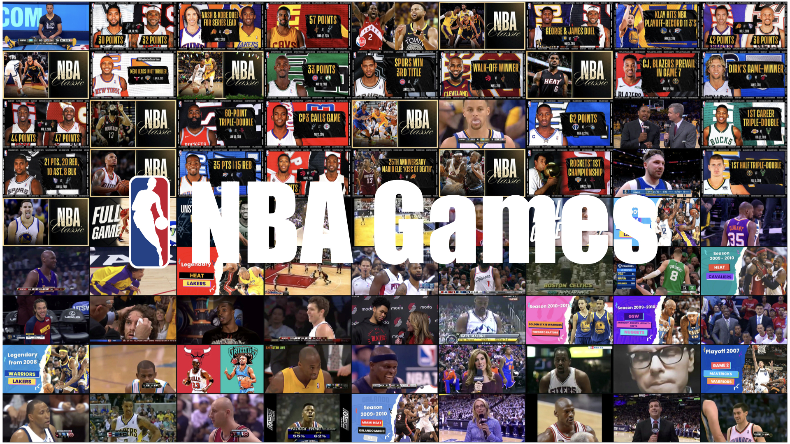

# NBA Full-Game Video Dataset

<p align="center">
  
</p>

<p align="center">
  <a href="https://github.com/choucisan/nba_games"></a>
  <a href="https://huggingface.co/datasets/choucsan/NBA_Games"></a>
  <a href="https://choucisan.github.io/collections/nba_games"></a>
  <a href="https://www.xiaohongshu.com/explore/6a0bfa950000000036019e44?xsec_token=ABMOfUoZI4fqfkoQyBURZvY1X7Kz11uX9Z4-15k_6UueE=&xsec_source=pc_user"></a>
  <a href="https://choosealicense.com/licenses/mit"></a>
</p>

This dataset provides metadata, official statistics, and official play-by-play annotations for full-length NBA game videos available on YouTube. Instead of redistributing video files, we provide YouTube video IDs and URLs so users can download videos independently when their use case and local policies allow it.

The dataset links long-form basketball videos with structured NBA.com game data. Each retained game has a verified YouTube video reference, a cleaned matchup and date, an official NBA box score, and, when available, official play-by-play event sequences.

---

## Pipeline

The dataset is built through a multi-stage cleaning and verification pipeline:

1. **Playlist extraction**: We started from the well-known YouTube NBA full-game playlist [`PLNbBj4TorBWerlzB1A5iM3XjwigqFG8sY`](https://www.youtube.com/playlist?list=PLNbBj4TorBWerlzB1A5iM3XjwigqFG8sY), one of the most widely referenced NBA full-game collections on YouTube, containing hundreds of historic and classic games. From this playlist we extracted video IDs, URLs, titles, descriptions, durations, upload dates, and channels.
2. **Valid-video filtering**: The raw crawl contained 595 playlist entries, including many placeholder rows such as `youtube video #...` without usable metadata. We retained entries with real titles and durations, producing 217 valid full-game candidates.
3. **Metadata normalization**: We cleaned each title into a canonical matchup format, for example `Golden State Warriors vs. Oklahoma City Thunder`, and parsed dates from title/description text. Missing or ambiguous fields were completed with LLM-assisted inference and manual verification.
4. **Official game localization**: For each candidate, we queried NBA.com date pages such as `https://www.nba.com/games?date=2016-02-27`, then matched the cleaned matchup against the official game list for that date.
5. **Historical-team handling**: We normalized NBA.com historical abbreviations and franchise names, including `PHL/PHI`, `SAN/SAS`, `NJN/BKN`, `NOH/NOP/CHA`, `SEA/OKC`, and All-Star abbreviations such as `EST/WST` and `LBN/GNS`.
6. **Official data crawling**: For matched games, we downloaded structured data embedded in NBA.com game pages, including official box-score data and play-by-play actions when available.
7. **Final filtering**: We removed candidates whose date/matchup could not be confidently matched to NBA.com. The final release contains 189 verified games.

---

## Dataset Structure

```text
NBA__Games/
├── nba_games.jsonl                        # One metadata record per retained YouTube game
├── games/
│   ├── 2016-02-27-gsw-vs-okc/
│   │   ├── video/                         # Empty placeholder; users may download video here
│   │   ├── box-score.jsonl                # Official NBA box-score rows
│   │   ├── play-by-play.jsonl             # Official NBA play-by-play rows, may be empty for older 
│   │   │ 
│   │   └── metadata.json                  # Source and official-game linkage metadata
│   ├── 2011-04-26-noh-vs-lal/
│   │   ├── video/
│   │   ├── box-score.jsonl
│   │   ├── play-by-play.jsonl
│   │   └── metadata.json
│   └── ...
```

Each game folder is named as:

```text
YYYY-MM-DD-away-vs-home
```

For example:

```text
2016-02-27-gsw-vs-okc
```

The folder name uses the official NBA.com home/away order after matching. The `video/` directory is intentionally empty.

---

## Dataset Overview

- **Total verified games**: 189
- **Total dataset duration**: ~347 hours (1,249,758 seconds)
- **Raw playlist entries**: 595
- **Valid full-game candidates before NBA.com verification**: 217
- **Metadata source**: YouTube playlist metadata and video descriptions
- **Official statistics source**: NBA.com game pages
- **Video distribution**: Video files are not included; only YouTube IDs and URLs are provided
- **Box-score format**: JSONL, one row per team or player
- **Play-by-play format**: JSONL, one row per event/action
- **Play-by-play availability**: 166 games include non-empty play-by-play files; 23 older games have empty play-by-play files
- **Total box-score rows**: 5,194
- **Total play-by-play rows**: 81,355

### `nba_games.jsonl`

| Field | Type | Description |
|---|---:|---|
| `id` | string | YouTube video ID |
| `url` | string | YouTube watch URL |
| `title` | string | Cleaned matchup in `Team A vs. Team B` format |
| `date` | string | Verified game date in `YYYY-MM-DD` format |
| `duration` | integer | YouTube video duration in seconds |
| `description` | string | YouTube description, or title fallback when description is unavailable |

Example:

```json
{
  "id": "I33o9UnUe1A",
  "url": "https://www.youtube.com/watch?v=I33o9UnUe1A",
  "title": "Golden State Warriors vs. Oklahoma City Thunder",
  "date": "2016-02-27",
  "duration": 7357,
  "description": "Steph Curry knocks down 12 threes, including the deep game-winner..."
}
```

---

## Box Score

Each `box-score.jsonl` file contains official NBA.com box-score information for one game. It uses JSON Lines so users can stream rows without loading a full file into memory.

Rows have two major types:

1. **Team rows**: `row_type = "team"`
2. **Player rows**: `row_type = "player"`

### Team row fields

| Field | Type | Description |
|---|---:|---|
| `source` | string | Data source, usually `nba.com` |
| `nba_game_url` | string | Official NBA.com game URL |
| `youtube_id` | string | Linked YouTube video ID |
| `youtube_url` | string | Linked YouTube URL |
| `game_date` | string | Game date |
| `row_type` | string | `team` |
| `game_id` | string | Official NBA game ID |
| `side` | string | `away` or `home` |
| `team_id` | integer | NBA team ID |
| `team_city` | string | Team city/name prefix |
| `team_name` | string | Team nickname |
| `team_tricode` | string | Team abbreviation |
| `team_slug` | string | NBA.com team slug |
| `score` | integer | Final team score |
| `periods` | list | Period-by-period score objects |
| `statistics` | object | Team-level statistics |

### Player row fields

Player rows share the same game/team linkage fields and add:

| Field | Type | Description |
|---|---:|---|
| `person_id` | integer | NBA player ID |
| `first_name` | string | Player first name |
| `family_name` | string | Player family name |
| `name_i` | string | Initialed display name |
| `player_slug` | string | NBA.com player slug |
| `position` | string | Listed position when available |
| `jersey_num` | string | Jersey number when available |
| `comment` | string | DNP/injury/comment field when present |
| `statistics` | object | Player box-score statistics |

The `statistics` object includes common box-score fields such as minutes, field goals, three-pointers, free throws, rebounds, assists, steals, blocks, turnovers, fouls, points, and plus-minus.

Example team row:

```json
{
  "source": "nba.com",
  "nba_game_url": "https://www.nba.com/game/gsw-vs-okc-0021500874",
  "youtube_id": "I33o9UnUe1A",
  "game_date": "2016-02-27",
  "row_type": "team",
  "game_id": "0021500874",
  "side": "away",
  "team_tricode": "GSW",
  "score": 121,
  "periods": [
    {"period": 1, "periodType": "REGULAR", "score": 20},
    {"period": 5, "periodType": "OVERTIME", "score": 18}
  ],
  "statistics": {
    "fieldGoalsMade": 45,
    "threePointersMade": 14,
    "reboundsTotal": 32,
    "assists": 25,
    "points": 121
  }
}
```

---

## Play-by-Play

Each `play-by-play.jsonl` file contains official NBA.com action-level event annotations for one game. Each line is one event/action ordered by game time.

Some older games do not have play-by-play available from NBA.com. For those games, the file exists but may be empty.

Common fields include:

| Field | Type | Description |
|---|---:|---|
| `source` | string | Data source, usually `nba.com` |
| `game_id` | string | Official NBA game ID |
| `nba_game_url` | string | Official NBA.com game URL |
| `youtube_id` | string | Linked YouTube video ID |
| `youtube_url` | string | Linked YouTube URL |
| `game_date` | string | Game date |
| `actionNumber` | integer | NBA.com action sequence number |
| `actionId` | integer | Action ID within the game feed |
| `period` | integer | Quarter/overtime period number |
| `clock` | string | ISO-8601-like game clock, e.g. `PT11M50.00S` |
| `teamId` | integer | Team ID associated with the action |
| `teamTricode` | string | Team abbreviation associated with the action |
| `personId` | integer | Player ID associated with the action |
| `playerName` | string | Player display name |
| `playerNameI` | string | Initialed player name |
| `description` | string | Human-readable play description |
| `actionType` | string | Event type, e.g. `Foul`, `Jump Ball`, `Made Shot` |
| `subType` | string | Event subtype |
| `scoreHome` | string | Home score after the action |
| `scoreAway` | string | Away score after the action |
| `pointsTotal` | integer | Total points after the action |
| `shotDistance` | integer | Shot distance when applicable |
| `shotResult` | string | Shot result when applicable |
| `isFieldGoal` | integer | Whether the action is a field-goal attempt |
| `xLegacy`, `yLegacy` | integer | NBA legacy shot-location coordinates when available |
| `videoAvailable` | integer | NBA.com video availability flag |

Example row:

```json
{
  "source": "nba.com",
  "game_id": "0021500874",
  "nba_game_url": "https://www.nba.com/game/gsw-vs-okc-0021500874",
  "youtube_id": "I33o9UnUe1A",
  "game_date": "2016-02-27",
  "actionNumber": 2,
  "clock": "PT11M50.00S",
  "period": 1,
  "teamTricode": "GSW",
  "personId": 201939,
  "playerName": "Curry",
  "description": "Curry P.FOUL (P1.T1) (S.Foster)",
  "actionType": "Foul",
  "subType": "Personal",
  "scoreHome": "0",
  "scoreAway": "0"
}
```

---

## Quick Start

### Install dependencies

```bash
pip install datasets huggingface_hub pandas yt-dlp
```

### Load metadata from Hugging Face

```python
from datasets import load_dataset

# Replace repo_id with the final Hugging Face dataset repo name.
repo_id = "choucsan/NBA_Games"

dataset = load_dataset(repo_id, data_files="nba_games.jsonl")
games = dataset["train"]

print(games[0])
```

Alternatively, download a single metadata file:

```python
from huggingface_hub import hf_hub_download
import json

repo_id = "choucsan/NBA_Games"

path = hf_hub_download(
    repo_id=repo_id,
    filename="nba_games.jsonl",
    repo_type="dataset",
)

with open(path, "r", encoding="utf-8") as f:
    games = [json.loads(line) for line in f]

print(f"Loaded {len(games)} games")
```

### Read box-score and play-by-play files

```python
from huggingface_hub import hf_hub_download
import json

repo_id = "choucsan/NBA_Games"
game_dir = "games/2016-02-27-gsw-vs-okc"

box_path = hf_hub_download(repo_id, f"{game_dir}/box-score.jsonl", repo_type="dataset")
pbp_path = hf_hub_download(repo_id, f"{game_dir}/play-by-play.jsonl", repo_type="dataset")

with open(box_path, "r", encoding="utf-8") as f:
    box_score = [json.loads(line) for line in f]

with open(pbp_path, "r", encoding="utf-8") as f:
    play_by_play = [json.loads(line) for line in f]

print(len(box_score), len(play_by_play))
```

### Download a YouTube video independently

Videos are not redistributed in this dataset. To download a video for local research use, use the `id` or `url` field with `yt-dlp`:

```bash
# Download one game by URL
yt-dlp -f "bv*+ba/b" \
  -o "games/2016-02-27-gsw-vs-okc/video/%(id)s.%(ext)s" \
  "https://www.youtube.com/watch?v=I33o9UnUe1A"
```

Or in Python:

```python
import subprocess

game = games[0]
subprocess.run([
    "yt-dlp",
    "-f", "bv*+ba/b",
    "-o", f"video/{game['id']}.%(ext)s",
    game["url"],
], check=True)
```

Please ensure that downloading and using videos complies with YouTube's Terms of Service, copyright rules, and your local research policies.

---

## Applications

This dataset is designed for research on long-form sports video and structured event understanding.

### Long Video Understanding

- Full-game temporal reasoning over 1.5-2.5 hour basketball videos
- Long-context video-language modeling
- Event localization from sparse textual queries
- Understanding momentum shifts, overtime, runs, and clutch sequences

### Visual Retrieval

- Query-by-text retrieval of plays, players, teams, and game situations
- Shot or possession retrieval using play-by-play descriptions
- Cross-modal retrieval between video frames, play text, and box-score statistics

### Temporal Prediction

- Score progression forecasting
- Next-action prediction from historical play sequences
- Win-probability and momentum modeling
- Player/team performance trajectory modeling

### Action Understanding

- Basketball action recognition, such as made shots, missed shots, fouls, rebounds, turnovers, substitutions, and jump balls
- Fine-grained temporal segmentation of long sports broadcasts
- Player-centric event grounding using `personId`, `playerName`, and action descriptions

### Multimodal Question Answering

- Video QA about what happened before/after a play
- Stat-grounded QA combining visual evidence with box-score rows
- Multi-hop questions linking play-by-play events to final outcomes
- Reasoning over player performance, team strategy, and game context

---

## Download

The dataset can be hosted on Hugging Face Datasets. Suggested layout:

```text
choucsan/NBA_Games
├── nba_games.jsonl
├── games/
│   └── */box-score.jsonl
│   └── */play-by-play.jsonl
│   └── */metadata.json
└── images/
    └── nba.jpeg
```

Example download commands:

```bash
# Download metadata only
huggingface-cli download choucsan/NBA_Games \
  nba_games.jsonl \
  --repo-type dataset \
  --local-dir NBA_Full_Game_Metadata

# Download all structured annotations
huggingface-cli download choucsan/NBA_Games \
  --repo-type dataset \
  --local-dir NBA_Full_Game_Metadata
```

Video files are not included. Use the `url` field in `nba_games.jsonl` to download videos independently when permitted.

---

## Contact

For questions, corrections, or collaboration requests:

[choucisan@gmail.com](mailto:choucisan@gmail.com)
